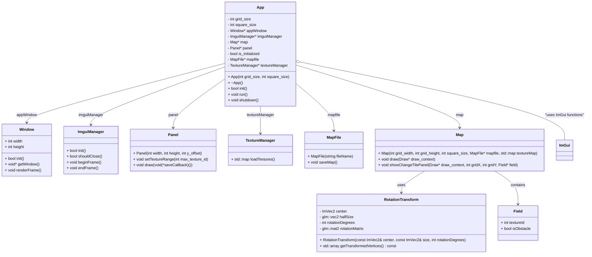

# UrbanMotion
AbstractProgrammingProject

Techniques:
- [ ] abstract classes and interfaces
- [ ] polymorphism
- [ ] templates and generic programming
- [ ] template metaprogramming - TMP
- [ ] concepts and constraints
- [ ] compile-time computations
- [ ] static polymorphism - CRTP
- [ ] type traits and SFINAE

## how to run locally
1. `mkdir build`
2. `cd build`
3. copy `map1.txt` to `build` dir
4. `cmake ..`
5. `cmake --build .`
6. `./UrbanMotion`

## chart
