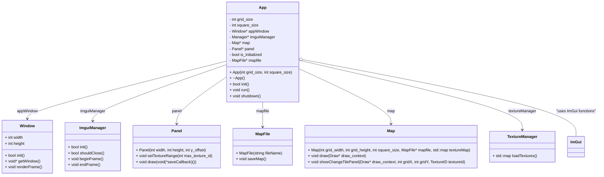

```mermaid
classDiagram
    class App {
        - int grid_size
        - int square_size
        - Window* appWindow
        - Manager* imguiManager
        - Map* map
        - Panel* panel
        - bool is_initialized
        - MapFile* mapfile
        + App(int grid_size, int square_size)
        + ~App()
        + bool init()
        + void run()
        + void shutdown()
    }

    class Window {
        + bool init()
        + int width
        + int height
        + void* getWindow()
        + void renderFrame()
    }

    class ImguiManager {
        + bool init()
        + bool shouldClose()
        + void beginFrame()
        + void endFrame()
    }

    class Panel {
        + Panel(int width, int height, int y_offset)
        + void setTextureRange(int max_texture_id)
        + void draw(void(*saveCallback)())
    }

    class TextureManager {
        + std::map<TextureID, int> loadTextures()
    }

    class MapFile {
        + MapFile(string fileName)
        + void saveMap()
    }

    class Map {
        + Map(int grid_width, int grid_height, int square_size, MapFile* mapfile, std::map<TextureID, int> textureMap)
        + void draw(Draw* draw_context)
        + void showChangeTilePanel(Draw* draw_context, int gridX, int gridY, TextureID textureId)
    }

    App --> Window : appWindow
    App --> ImguiManager : imguiManager
    App --> Panel : panel
    App --> MapFile : mapfile
    App --> Map : map
    App --> TextureManager : textureManager
    App o-- ImGui : "uses ImGui functions"
```