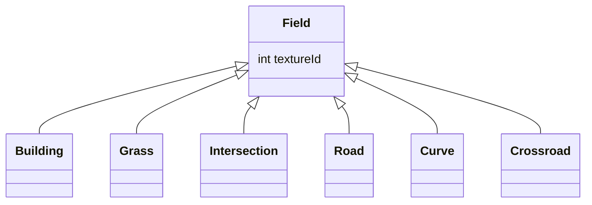

```mermaid
classDiagram
    class Field {
        int textureId
    }
    class Building {
    }
    class Grass {
    }
    class Intersection {
    }
    class Road {
    }
    class Curve {
    }
    class Crossroad {
    }

    Field <|-- Building
    Field <|-- Grass
    Field <|-- Intersection
    Field <|-- Road
    Field <|-- Curve
    Field <|-- Crossroad
```